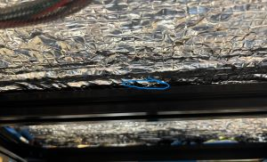
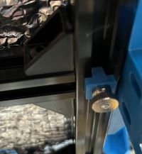
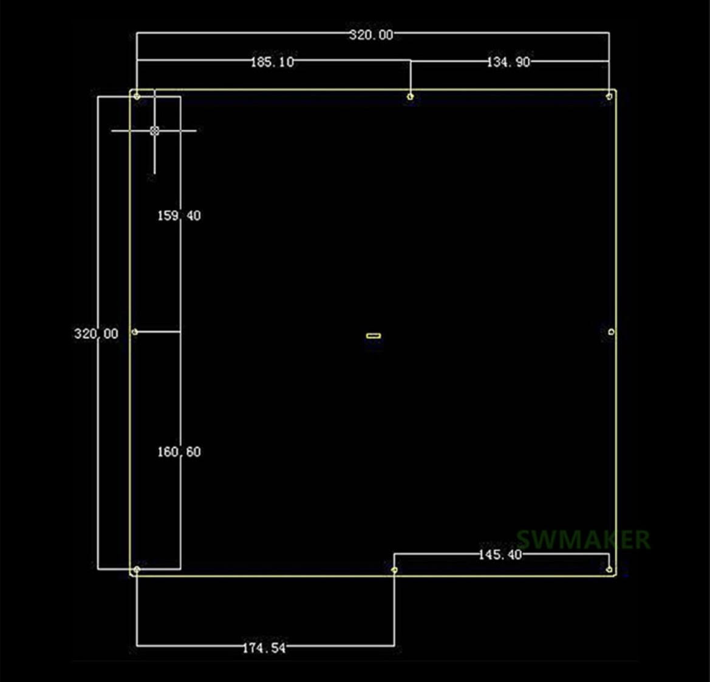

# Bed Leveling

## Bed Leveling Shim

For putting under silicone leveling columns to address bed warp, etc. I needed extra space for insulation I installed to the bottom of the heatbed.

## Bed Screw Plate

A small part to put into the underside channel of the 2020 extrusion under the side center mounting holes to support a thumbscrew.  I drilled holes through the center of the 2020 extrusions of the bed frame so that the mounting screw goes all the way through the frame, through the screw plate and attached with a thumb screw on the bottom.  I also used a cut silicone mount similar to the ones described here: https://wiki.layerfused.com/en/printers/mods/johanmalay/8-point-bed-mount

## Bed Hole Placement

An image I found on an image search (source unknown, image watermarked SWMaker).

