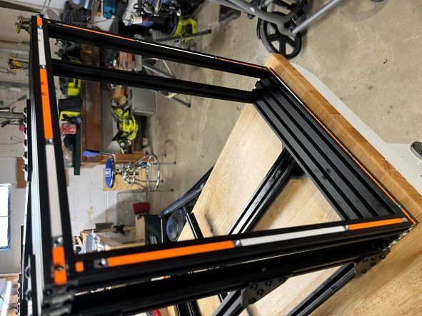
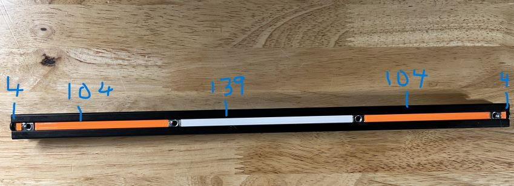
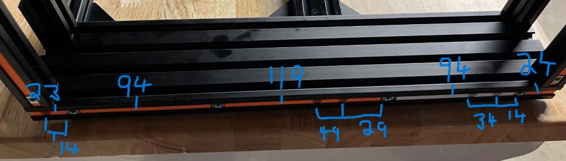
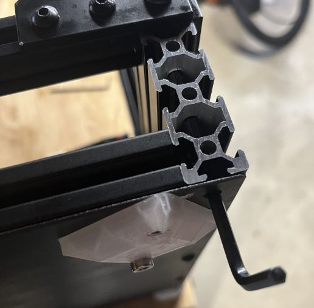
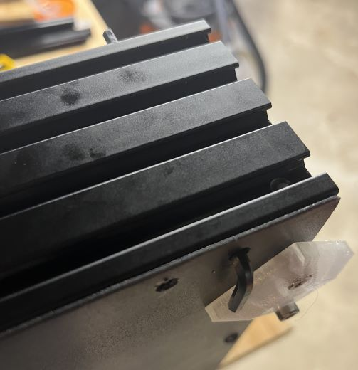
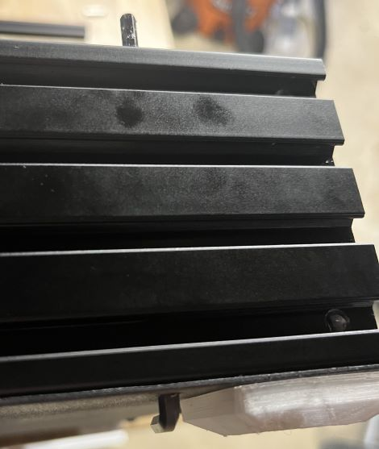
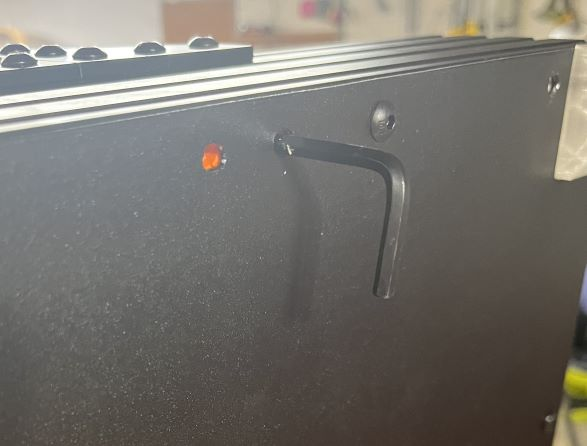

# Spacers

When base plate has access holes drilled for the blind joints, a couple of access holes are covered by the feet.  Since the feet need removed to access those holes there is a chance of losing the t-nuts inside the extrusion (particularly the front and back ones) and getting them lined back up would be difficult.  Switching the plate mounting to use sliding type t-nuts (instead of the spinning hammer type) and using spacers to help keep them aligned inside the extrusions may help with this problem.

The base plate is 440mm across the front and back and 400mm on the sides.  The feet attach 30mm in from each corner.  Across the front and back, I put holes for attachment 145mm from each edge.  Along the sides, I put holes at 135mm from each edge.

There are blind joint access holes along the sides.  One is under the foot at 30mm for a 2040 vertical with a hole also at 50mm; this is for a 20mm setback for a 3z setup.  Spacers for a 3z at a 40mm setback are not included. There are access holes at 170mm and 190mm for the 2040 vertical at its standard 2z setup.  There is a 10mm access hole from the back (under the back foot) for the rear corner 2020s.

M5 sliding t-nut (specs are 10mm wide, actual measured 9.5mm)

## Front and Back Order

1. 4mm spacer
2. t-nut (foot 30mm)
3. 104mm spacer
4. t-nut (145mm from edge)
5. 139mm spacer
6. t-nut (145mm from far edge)
7. 104mm spacer
8. t-nut (foot 30mm)
9. 4mm spacer

## Side Order (From the Front)

1. 24mm spacer (only if there are end covers and if the end covers don't interfer)
2. t-nut (foot and access hole 30mm)
3. 94mm spacer with access holes at 14mm and 34mm (3z position 20mm setback) from edge of spacer
4. t-nut (135mm from front)
5. 119mm spacer with access holes at 29mm and 49mm (2z stock position)
6. t-nut (135mm from back)
7. 94mm spacer
8. t-nut (foot 30mm from back)
9. 23mm spacer with access holes at 14mm (10mm from back for back corner verticals, only if there are end covers and if the end covers don't interfer)

## Accessing the Rear Corner Blind Joint

1. Slightly loosen the Foot Screw along the back, but don't remove.
2. Completely unscrew the Foot Screw along the side and allow the foot to swing away.
3. Insert hex key into the access hole.

## Accessing the Front Z Blind Joint at 30mm

1. Slightly loosen the Foot Screw along the front, but don't remove.
2. Completely unscrew the Foot Screw along the side and allow the foot to swing away.
3. Use a screwdriver, pick, or another similar tool to slide the t-nut out of the way.
4. Insert hex key into the access hole.

## Accessing Other Blind Joint Holes

The other holes can be accessed directly, although the spacers may need to be slid back into place due to tolerances built into the length of the spacers.

