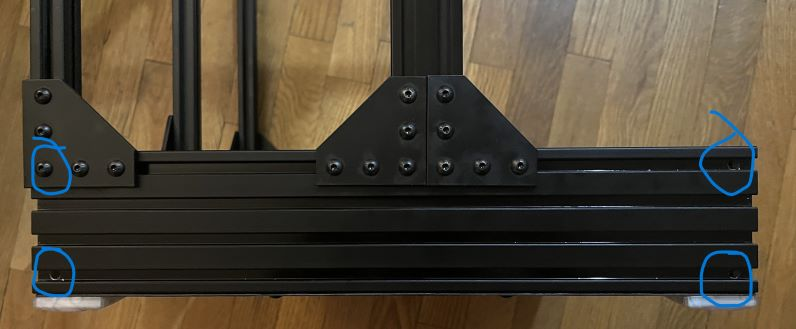

# Blind Joint

Blind Joint setup for LayerFused X301.

## Drill Bit

I used a 7/32 drill bit, M6 Button Head screws (as appropriate for my extrusions), and a 4mm hex key.  Other extrusions may be tapped for M5 screws and a smaller hex key; therefore could accomodate a smaller drill bit.  If needed for your extrusions, tap opposite holes with appropriate tap; mine needed an M6 tap.

## Rear Corner Brackets

The Rear Corner Brackets (https://bitbucket.org/makersmashup/x301-models/src/master/STL/Rear%20Corner%20Bracket%20Top%20v2.stl) can be installed by pushing them down below the joint access holes, tightening the joints, and then raising the bracket up.  The two inner corner T-Nuts on each corner bracket are changed to a sliding type T-nut (rather than the spinning hammer type), which are preloaded into the extrusions prior to attaching the blind joint.

## Extrusion Access Holes

### Side 2080 and Side Top 2020 Access Holes for 2040 and 2020 Vertical Attachment

For attachment to 2040 Vertical drill an access hole at 170mm and 190mm from the front.  For a 3z mod where the 2040 is setback at 20mm from the front drill access holes at 30mm and 50mm. For the rear corner 2020 vertical drill an access hole 10mm from rear.

### Side 2080 Access Holes for Front and Rear Attachment

In the top and bottom channel drill an access hole 10mm in from the edge on both sides; total of four holes per 2080.

### Side Top 2020 Access Holes for Rear Top 2020 Attachment

In the side top 2020s drill an access hole 10mm from the edge.

### Rear Top 2020 and Rear Base Top 2020 Access Holes for Attachment to a 3z Vertical 2020

For 3z mod, in the 2020 drill an access hole 200mm (centered) for the 3z 2020 vertical.

### Bed Frame Access Holes

In the bed side 2020s, drill an access hole 150mm (centered); this makes the H frame of the bed.

For a 6+2 mod, also drill holes 10mm from each end of the bed side 2020s.

## Base Plate

The base plate can, optionally, be drilled with access holes for the sides which coorespond to the access holes for the 2080 attachment to verticals.

If the base plate is drilled the use of sliding style t-nuts and spacers can help with the danger of losing t-nuts when accessing the blind joints, because some access hole positions are underneath the feet.
