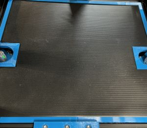
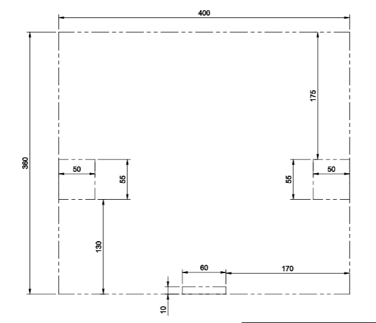

# Corregated Plastic Cover

*** DRAFT ***

*This is a draft.  I used these parts, but am not very happy with them.  If I ever need to redo this, I will try modifications*

Cut correcgated plastic to dimensions accounting for 2.5mm edge cover thickness plus some tolerance.  The wings on the edge cover are 7.5mm to cover some amount of play.

So cut a rectangle approx 394mm by 354mm for the 400mm by 360mm area.  That is 400/360mm - 2.5 for each side and 1mm tolerance.

For the steppers in the standard 2z configuration, center the cutout at 150mm (minus any tolerance, so 149mm-ish) from the front edge. The part for the cutout is 45mm wide, so the cutout needs to be at least 50mm wide plus some tolerance.  The depth of the hole is meant to be 45mm in, so make that cut 47.5 plus some tolerance.

Here are the parts needed:

* 47.5mm by 27.5mm corner (outside dimension 50 x 30) X 2
* 149mm straight part for the front and back X 4
* 139mm straight part for the sides behind the steppers X 2
* 89mm straight part for the sides in front of the steppers X 2
* 10mm corners for the transition from the steppers to the straight sides X 4

## Changes needed

* The pinch is set to 1mm tighter than the width of the corregated plastic, which fit good with the test part, but was too much friction on the larger pieces (I had to "lightly" hammer some parts in place).  Might try 0.75 or 0.50 instead.
* Considering merging the 10mm corners with the stepper arches.  Especially if loosing the pinch, as those small corners don't have the same bite area, and may be too loose on their own.
* Integrating options for small wire paths, somehow.

# Stock Cover Dimensions and Source

https://bitbucket.org/makersmashup/x301-models/src/master/DWG/Acrylic%20Cover%20Drawing.dwg
