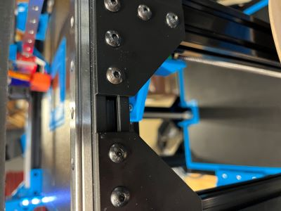
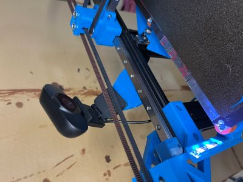
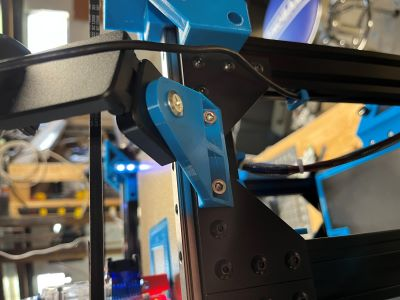

# Webcam Mount

A webcam mount to attach to the top 2020 extrusions with notches to overlap with 4mm corner plates.  

The design fits the space in my build between the center and front 2040 corner plate locations. 

There are also mounts for a 4mm plate on just the left or right, and a flush mount.

# License

https://creativecommons.org/licenses/by-sa/4.0/